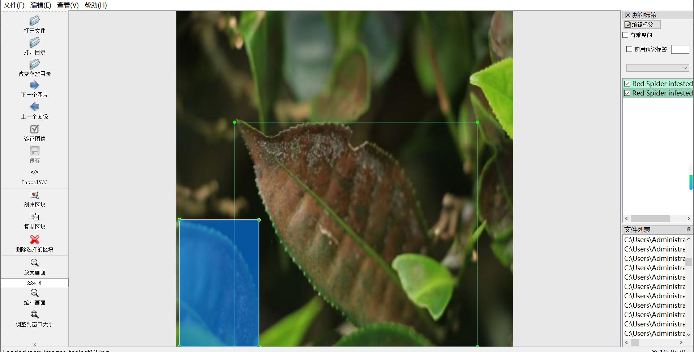
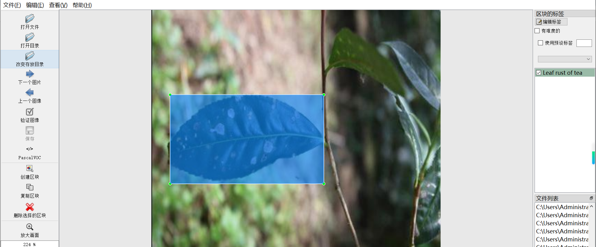
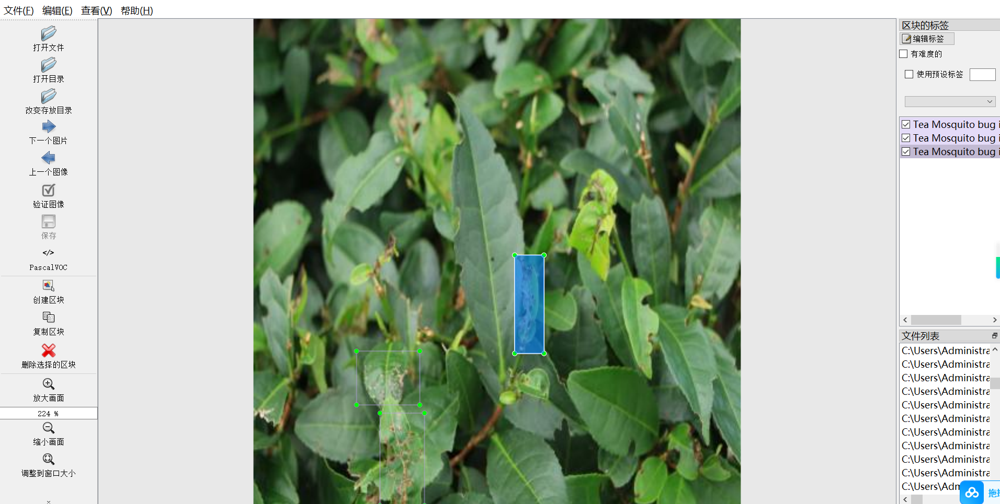
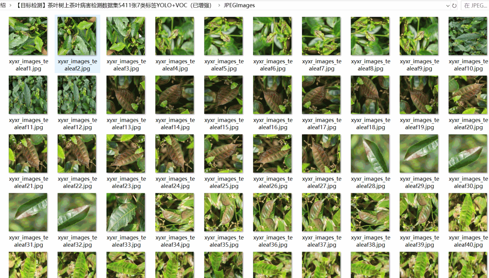
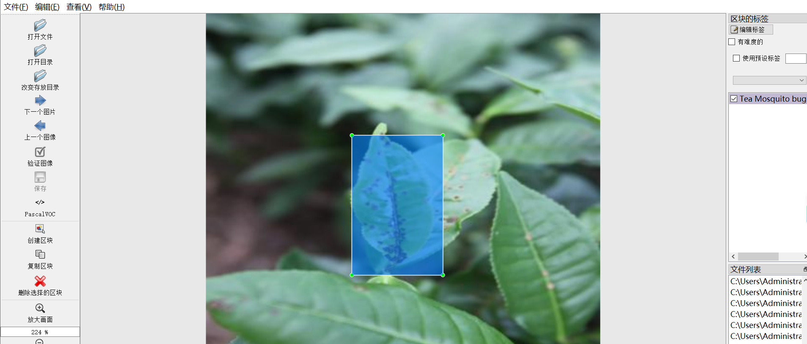

# [Object Detection] Tea Tree (data structure) on Tea Disease Detection Dataset 5411 images7-classLabels YOLO+VOC（(Augmented) ）

Dataset Format: Pascal VOC + YOLO (excluding the split-path txt file; only jpg images with corresponding VOC-format xml files and YOLO-format txt files)

The compressed file contains: three folders, each storing images, xml files, and text files.

The total number of JPEG images in the JPEGImages folder is 5411.

The total number of XML files in the Annotations folder: 5411.

The total number of txt files in the labels folder is 5411.

Number of tag types: 8

Tags: ["Black rot of tea", "Brown blight of tea", "Leaf rust of tea", "Red Spider infested tea leaf", "Tea Mosquito bug infested leaf", "White spot of tea", "disease", "healthy"]

The number of boxes for each label (Note that the order of labels in the Yolo format does not correspond to this, but is based on the classes.txt file in the labels folder):

Black rot of tea = 77 (black rot disease)

Brown blight of tea = 3 (Brown rot)

Leaf rust of tea = 1871 (Puccinia sinica)

Red Spider infested tea leaf frame count = 669 (red spider)

Preserve the original meaning, format markers (【】『』「」<>[]), numbers, English words, and special characters as-is. Output ONLY the English translation, no explanations, no quotes.

White spot of tea frame count = 193 (white spot)

Disease Frame Count = 3

healthy frame count = 276 (healthy)

Total frame count: 7276

Picture clarity (Resolution: Pixels): Clear

Image Enhancement: Yes

Shape of the label: Rectangular box, used for object detection and recognition.

Dataset Type ：119m

Special Notice: This dataset does not guarantee the accuracy or precision of the trained models or weight files. The dataset only provides accurate and reasonable annotations.

Preserve the original meaning, format markers (【】『』「」<>[]), numbers, English words, and special characters as-is. Output ONLY the English translation, no explanations, no quotes.
## Images

---

Here is a pay link on Stripe (https://buy.stripe.com/3cs8yP7sY87d0vu9AB). Please contact me lonlonago@foxmail.com after funding $89, and I will send you a complete data files, thank you!

